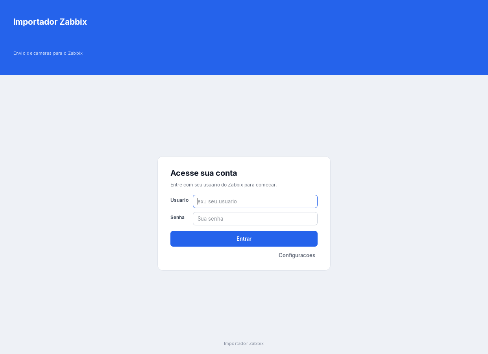
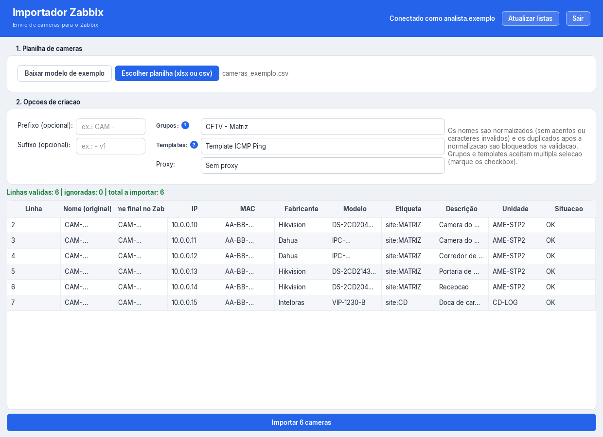
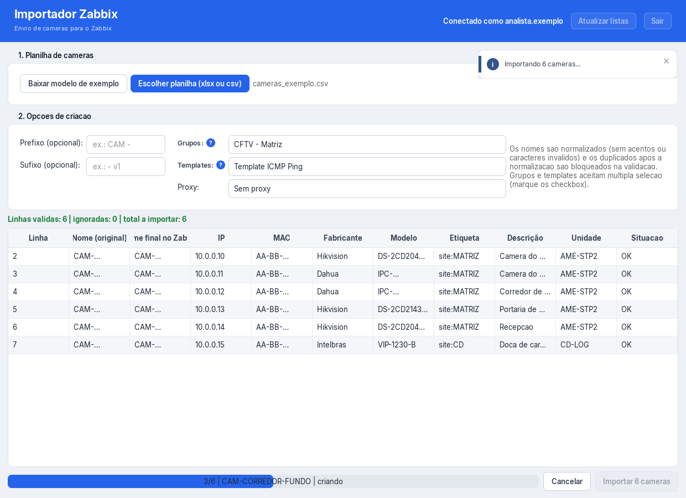

# Importador Zabbix

[](https://github.com/lucasdaniel2201/zabbix-camera-importer/actions/workflows/tests.yml)
[](LICENSE)
[]()
[]()
[](https://www.zabbix.com/documentation/current/en/manual/api)

Importa em lote hosts de camera de CFTV para o Zabbix a partir de uma planilha
(`.xlsx` ou `.csv`), em uma janela de aplicacao desktop.

A criacao dos hosts usa a **API JSON-RPC do Zabbix 6.4** (`api_jsonrpc.php`): o
login e feito com `user.login` e o token viaja no header `Authorization: Bearer`;
a criacao e feita com **um `host.create` por camera**. Esse transporte substituiu
o envio pelo formulario web do frontend que a versao 1.0.0 usava.

**Projetos relacionados:** este app e o par do
[netbox-device-importer](https://github.com/lucasdaniel2201/netbox-device-importer),
que **documenta** o mesmo parque de cameras e switches no NetBox. Um registra o
que existe; este coloca o que existe para **monitorar**. A planilha de entrada
pode ser a mesma nos dois.

**Sumario**

- [Para quem vai usar](#para-quem-vai-usar)
- [Telas](#telas)
- [Como usar](#como-usar)
- [Como a importacao fala com o Zabbix](#como-a-importacao-fala-com-o-zabbix)
- [A planilha modelo](#a-planilha-modelo)
- [Layout aplicado no Zabbix](#layout-aplicado-no-zabbix)
- [Regras da importacao](#regras-da-importacao)
- [Relatorios](#relatorios)
- [Preparar a planilha e consolidar execucoes](#preparar-a-planilha-e-consolidar-execucoes)
- [Credenciais](#credenciais)
- [Arquitetura](#arquitetura)
- [Testes](#testes)
- [Build do executavel](#build-do-executavel)
- [Instalador e portatil](#instalador-e-portatil)
- [Ao lancar uma nova versao](#ao-lancar-uma-nova-versao)
- [Onde o app grava arquivos](#onde-o-app-grava-arquivos)
- [Limitacoes conhecidas](#limitacoes-conhecidas)
- [Status](#status)
- [Estrutura do projeto](#estrutura-do-projeto)
- [Para quem vai mexer no codigo](#para-quem-vai-mexer-no-codigo)
- [Controle de versao](#controle-de-versao)
- [Licenca](#licenca)

## Para quem vai usar

Baixe o `ImportadorZabbixSetup-<versão>.exe` mais recente na pagina de
**Releases** do repositorio e execute. A instalacao e **por usuario** (nao pede
administrador), cria atalho no Menu Iniciar e tem desinstalador.

Requisitos:

- Windows 10/11 x64. Nao precisa de Python instalado.
- Zabbix 6.4 com o endpoint `/api_jsonrpc.php` acessivel a partir da maquina
  (firewall ou proxy que bloqueie a API impede o uso do app).

A mesma Release traz o **executavel portatil** (`ImportadorZabbix.exe`), para o
caso de nao dar para instalar. A escolha entre os dois esta em *Instalador e
portatil*, mais abaixo.

## Telas

| Login | Planilha carregada | Importacao em andamento |
| --- | --- | --- |
|  |  |  |

Os prints sao gerados por um utilitario de desenvolvimento
(`tools/screenshots.py`), rodando o app sem abrir janela, e usam apenas dados
ficticios.

## Como usar

O app tem duas telas: **login** (usuario e senha do Zabbix) e o **ambiente de
importacao** (planilha, opcoes de criacao e preview).

### Login

- A URL do Zabbix e a porta da interface ficam em **Configuracoes**, no canto do
  card de login. A URL e usada na conexao; a porta, na criacao dos hosts.
- Usuario e senha sao pedidos na tela e **nao sao gravados em disco**. A senha
  some do campo assim que a conexao da certo.
- Ao conectar, o app busca no servidor os **grupos, templates e proxies**
  disponiveis e preenche os seletores. O botao "Atualizar listas" refaz a
  consulta a qualquer momento, e "Sair" encerra a sessao local e limpa as listas.
- O token devolvido por `user.login` fica **so na memoria do processo** e e
  reaproveitado entre importacoes: nao ha novo login a cada importacao.

### Ambiente de importacao

1. **Baixar modelo de exemplo**: um popup permite escolher as colunas opcionais
   do modelo. As colunas fixas sao apenas **Nome do host** e **IP**. O arquivo
   `modelo_cameras.xlsx` e gerado na pasta que voce escolher.
2. **Escolher planilha**: aceita `.xlsx` ou `.csv`. O app valida linha a linha e
   mostra o **preview** do que sera criado, com os nomes ja normalizados.
3. **Opcoes de criacao**: prefixo e sufixo (opcionais) e a escolha de grupos,
   templates e proxy. Grupos e templates aceitam **multipla selecao** e
   **comecam sem nenhuma marcacao**; sem ao menos um grupo, a importacao fica
   bloqueada.
4. **Importar**: o progresso aparece por camera, com botao de cancelar. Ao final,
   um resumo mostra criados, ja existentes e erros, alem do caminho do relatorio.

## Como a importacao fala com o Zabbix

Toda a conversa passa por `POST /api_jsonrpc.php`. As chamadas usadas:

| Chamada | Para que serve |
| --- | --- |
| `user.login` | Autentica e devolve o token (`sessionid`). |
| `apiinfo.version` | Versao do servidor, conferida logo apos o login. |
| `hostgroup.get`, `template.get`, `proxy.get` | Preenchem os seletores de grupos, templates e proxy. |
| `host.get` | Pre-consulta dos nomes tecnicos em blocos de 200, antes do lote. |
| `host.create` | Cria **um host por camera**. |

O token vai no header `Authorization: Bearer <token>` e tambem no campo `auth`
do corpo JSON-RPC.

**Pre-consulta antes do lote.** Antes de criar, o app pergunta ao servidor quais
dos nomes ja existem (em blocos de 200 por chamada) e marca essas linhas como
`exists` sem gastar uma chamada de criacao. A mensagem de erro "already exists"
continua sendo tratada, como rede de seguranca.

**Token expirado no meio da execucao.** Se uma chamada autenticada volta com
"session terminated" ou "not authorized", o app refaz o `user.login` **uma vez** e
repete a chamada. Se a segunda tentativa falhar, o erro vai para o relatorio
como `error` e o lote continua na proxima linha.

**Fechar o app nao encerra a sessao no servidor.** O app nunca chama
`user.logout`: fechar a janela ou clicar em "Sair" fecha a conexao HTTP e limpa
o token da memoria, mas o token continua valido no Zabbix ate o **timeout de
sessao** configurado no servidor. O relog automatico descrito acima e o que cobre
esse intervalo.

## A planilha modelo

Colunas: Nome do host, IP, Fabricante, Modelo, Firmware, Endereço MAC, Unidade,
Etiqueta, Descrição.

- **Nome do host**: obrigatorio. E normalizado para ASCII antes de ir ao Zabbix
  (o Zabbix rejeita acentos e alguns caracteres).
- **IP**: obrigatorio. E o IP da interface `agent` da camera.
- **Fabricante + Modelo + Firmware + Endereço MAC**: vao para o inventario do
  host (`name`, `type`, `vendor`, `hardware`, `hardware_full` e `macaddress_a`).
- **Etiqueta**: formato `chave:valor`, com varias separadas por `;`
  (ex.: `site:MATRIZ`).
- **Descrição**: campo Description do host no Zabbix.
- **Unidade**: apenas orientacao para quem preenche, nao vai para o Zabbix.

Cabecalhos antigos tambem sao aceitos como alternativa (ex.: `Name`, `IP/Nome`,
`Fabricante:`, `MAC`), porque a planilha de cameras existe em mais de um formato
de exportacao.

**Grupo de host, template e proxy nao vem da planilha**: sao escolhidos na tela
do app e aplicados a todas as linhas.

## Layout aplicado no Zabbix

Valores usados em cada `host.create`:

| Campo | Valor |
| --- | --- |
| `host` / `name` | O `Nome do host` normalizado, com prefixo e sufixo da tela. O mesmo prefixo e sufixo vao para o nome tecnico e para o nome visivel. |
| `status` | `0` (monitorado). |
| `inventory_mode` | `0` (manual). |
| `interfaces[0].type` | `1` (agent). |
| `interfaces[0].main` | `1` (principal). Exigido pela API. |
| `interfaces[0].useip` | `1`, com o IP da camera em `ip` e `dns` vazio. |
| `interfaces[0].port` | A porta de *Configuracoes*, padrao `10051`. |
| `groups` / `templates` | Os itens marcados na tela (multipla selecao). |
| `proxy_hostid` | So e enviado quando ha proxy escolhido; "Sem proxy" omite a chave. |
| `description` | So e enviado quando a coluna esta preenchida. |
| `tags` | `[{tag, value}]`, na ordem da coluna. |
| `inventory` | `name` = fabricante, `type` = modelo, `vendor` = fabricante, `hardware` = modelo, `hardware_full` = modelo com firmware, `macaddress_a` = MAC. |

## Regras da importacao

**Normalizacao.** Nomes sao convertidos para ASCII; uma linha cujo nome mude e
marcada com **aviso** no preview e o nome final aparece na coluna "Nome final no
Zabbix".

**Linhas ignoradas.** Linha sem nome e linha cujo nome contenha "troca realizada"
sao puladas na leitura e contabilizadas como ignoradas, separadas no preview.
Ficaram na planilha para conferir, nao entram no lote.

**Duplicados bloqueiam.** Dois nomes que colidem depois da normalizacao sao
tratados como **erro**: a importacao fica bloqueada ate voce corrigir na planilha.

**Validacao antes de enviar.** Enquanto houver linha com IP vazio, formato de IP
invalido ou nome invalido, o botao de importar nao libera; o botao vira "Corrija
os erros na planilha". MAC com formato incomum e **aviso**, nao erro.

**Grupo de host obrigatorio.** Nao ha default no codigo: sem um grupo marcado a
importacao nao comeca, e o botao mostra "Marque ao menos um grupo".

**Hosts existentes nao interrompem o lote.** Um host que ja existe no Zabbix e
marcado como `exists` (pela pre-consulta ou pela mensagem "already exists"), e o
lote segue.

**Cancelamento por linha.** O botao de cancelar para depois do registro atual. O
lote parcial e gravado nos relatorios e o resumo sai marcado como cancelado.

**Falha de sessao no meio do caminho.** Se o token expirar durante uma execucao
longa, o app reloga uma vez e continua (ver *Como a importacao fala com o
Zabbix*).

## Relatorios

Cada execucao grava tres arquivos em `reports/`, com o prefixo
`zabbix-import-`:

| Arquivo | Conteudo |
| --- | --- |
| `zabbix-import-<data-hora>.log` | Uma linha por host. |
| `zabbix-import-<data-hora>.json` | Resumo da execucao mais o resultado por linha. |
| `zabbix-import-<data-hora>.csv` | Resultado por linha, em planilha. |

O status de cada linha tem um de tres valores: `created`, `exists` ou `error`.

O `consolidate.py` junta o resumo de varias execucoes em um resumo unico, para
revisar um lote grande depois. Ele le os dois prefixos: o atual
(`zabbix-import-`) e o legado (`zabbix-web-import-`), gerado antes da migracao
para a API, para o historico antigo continuar contando.

## Preparar a planilha e consolidar execucoes

O app le `.xlsx` e `.csv` direto, com normalizacao e validacao na leitura. Nao ha
script de conversao no meio do caminho. Para comecar do zero, use o botao
"Baixar modelo de exemplo", que gera `modelo_cameras.xlsx` com as colunas fixas
e as opcionais que voce marcar.

Depois de varias execucoes, o resumo consolidado sai de:

```powershell
python .\consolidate.py
```

Os dados de entrada (`*.xlsx`, planilhas do cliente) **nao sao versionados**:
contem informacao do ambiente do cliente.

## Credenciais

Nada de credencial fica salva em disco:

- **Usuario e senha** sao pedidos na tela de login e nao vao para nenhum
  arquivo. A senha e apagada do campo quando a conexao da certo.
- **Token** do `user.login` fica so na memoria do processo (no `SessionWorker`),
  nunca em disco, e some quando a sessao termina ou o app fecha.
- O `user.logout` nao e chamado; o token expira pelo timeout de sessao do
  Zabbix.
- `.env` e proibido por decisao de projeto, e `tests/test_credentials.py`
  falha se um `.env` aparecer ou se alguma senha for embutida no codigo.

## Arquitetura

O principio e o mesmo dos projetos irmaos: **a interface pede, o worker executa.**
Nenhuma tela fala com a rede.

```
app/main_window.py  (UI - thread principal)
     |  emite sinais do Qt
     v
app/session.py - SessionWorker  (QObject em QThread propria)
     |  dono de um unico ZabbixApiClient e do token
     v
zabbix_importer.py - core (ZabbixApiClient: user.login + host.create)
     |
     +-- JSON-RPC --> /api_jsonrpc.php
                       user.login, hostgroup.get, template.get,
                       proxy.get, host.get, host.create
```

- `zabbix_importer.py` concentra a regra de negocio: cliente JSON-RPC,
  normalizacao de nomes, montagem dos parametros do `host.create`, classificacao
  de erro e escrita dos relatorios. E o core unico do projeto.
- `app/main_window.py` nunca chama a rede: emite sinais do Qt e reage a sinais de
  volta. E o que mantem a janela respondendo.
- `app/session.py` tem o `SessionWorker`, um `QObject` movido para uma `QThread`
  com `moveToThread`. Login, busca das listas e importacao rodam nessa thread, e
  o Qt entrega os resultados por conexao enfileirada.
- `app/spreadsheet.py` e puro de proposito: le e valida a planilha sem tocar na
  rede, o que o torna testavel offline. Ele usa o core para normalizar nomes e
  casar cabecalhos, nunca o cliente.
- **Um `host.create` por host**, e nao `host.massadd`: e o que da um resultado
  por linha no relatorio e faz o cancelamento valer para a linha que esta sendo
  enviada.
- O log, a pre-consulta e a montagem do host usam **a mesma funcao** de nome
  (`host_names`), entao nao ha como o relatorio divergir do que foi criado.

## Testes

```powershell
python -m unittest discover -s tests
```

 sao **120 testes**, apenas com a stdlib (`unittest`), e rodam **sem rede nem
Zabbix**. Cobrem a normalizacao de nomes, o payload do `host.create`
(`status`, `inventory_mode`, `main` da interface, inventario, tags, descricao),
a classificacao de erro da API (host existente e falta de permissao), o login e
o header `Authorization: Bearer`, o relog unico em caso de sessao expirada, a
pre-consulta de existentes em blocos, o fato de `close` nao chamar `user.logout`,
as colunas da planilha, a validacao linha a linha, as regras de UX das
notificacoes, a resolucao de caminhos e a ausencia de credencial embutida no
codigo.

Rode antes de alterar o core ou o modulo de planilha: sao esses testes que
protegem contra a volta de erros ja corrigidos (nome duplicado, IP invalido,
proxy omitido, coluna obrigatoria ausente).

O CI roda essa suite no Python 3.12 e 3.14 no `windows-latest` (o produto e
Windows) e o Ruff em um job separado no Linux. O estado esta no badge no topo.

## Build do executavel

```powershell
pip install "pyinstaller>=6,<7"
python -m PyInstaller --clean --noconfirm ImportadorZabbix.spec
```

Gera `dist\ImportadorZabbix.exe`: arquivo unico, sem console, com icone e os
metadados de `version_info.txt`. Os assets (icone e fonte Inter) vao embutidos e
sao resolvidos por `app/paths.py`. O `zabbix_importer` esta em `hiddenimports`,
porque e importado da raiz do projeto.

Atencao ao editar o `.spec`: nao exclua da stdlib modulos que as dependencias
usam. `email` (usado por `requests`/`urllib3`) e `xml` (usado por `openpyxl`)
ja quebraram o executavel quando foram excluidos.

## Instalador e portatil

A Release publica dois binarios. **Use o instalador, salvo se nao puder.**

| Binario | Quando usar |
| --- | --- |
| `ImportadorZabbixSetup-<versão>.exe` (instalador) | **Padrao.** Instala por usuario em `%LOCALAPPDATA%\Programs\Importador Zabbix`, sem pedir administrador; cria atalho no Menu Iniciar e, opcionalmente, na Area de Trabalho; instala o desinstalador e e atualizavel por cima. |
| `ImportadorZabbix.exe` (portatil) | Quando nao der para rodar instalador (politica da maquina) ou quando o app precisar rodar de pendrive ou pasta de rede. Nao cria atalho nem desinstalador: o arquivo roda de onde estiver. |

Para **gerar** os dois, requer o [Inno Setup 6](https://jrsoftware.org/isdl.php):
o executavel vem do PyInstaller, acima.

```powershell
& "C:\Program Files (x86)\Inno Setup 6\ISCC.exe" instalador.iss
```

O `instalador.iss` empacota o `dist\ImportadorZabbix.exe` ja gerado, por isso o
PyInstaller roda primeiro.

## Ao lancar uma nova versao

A mudanca entra no branch `main` (`origin/main`); e de la que vem o estado
descrito neste README e no `CHANGELOG.md`.

1. Atualize `AppVersion` no `instalador.iss`.
2. Atualize a versao no `version_info.txt`.
3. Registre a versao no `CHANGELOG.md` (o que mudou e por que).
4. Gere o executavel e o instalador.
5. Publique a Release no GitHub com os dois binarios.

**Nunca mude o `AppId`** do instalador daqui para frente: e ele que permite
atualizar por cima e desinstalar corretamente. (A versao 1.0.0 foi a excecao: o
`AppId` mudou junto com o nome do produto, que colidia com o do app do NetBox.)

O que nao versionar: `build/` e `dist/` (artefatos). O `ImportadorZabbix.spec` e
o `instalador.iss` **sao** versionados - sao a configuracao do build.

## Onde o app grava arquivos

| Conteudo | Local |
| --- | --- |
| Relatorios (`reports/`) e `app_error.log` | Codigo-fonte: raiz do projeto. `.exe`: ao lado do executavel; se a pasta nao for gravavel, `%LOCALAPPDATA%\ImportadorZabbix`. |

Resolvido por `app/paths.py`.

## Limitacoes conhecidas

- **A API precisa estar acessivel.** O app fala com `/api_jsonrpc.php`; firewall,
  proxy ou reverse proxy que bloqueie esse endpoint impedem o uso. Era o motivo
  do fluxo pelo formulario web na versao 1.0.0.
- **Uma chamada por camera.** Nao ha `host.massadd`: em lote muito grande o
  envio fica mais lento que uma chamada so. Em troca, cada linha tem resultado
  proprio no relatorio e o cancelamento vale por linha.
- **Permissao do usuario do Zabbix.** Sem escrita em *Host inventory* e
  *Templates* e nos grupos marcados, o `host.create` volta com erro de
  permissao; a mensagem no relatorio diz isso.
- **Grupo de host obrigatorio.** Sem ao menos um grupo marcado a importacao nao
  comeca.
- **Sem retomada automatica.** Linha com erro fica `error` no relatorio e nao e
  reprocessada; na proxima execucao ela reaparece como `exists` se o host foi
  criado a meio caminho. E preciso corrigir e rodar de novo.
- **Token expirado cobre uma unica falha.** O relog automatico acontece uma vez
  por chamada. Uma execucao longa que sofra varias expiracoes seguidas marca as
  linhas como `error`.
- **Limite de tamanho no servidor.** O Zabbix tem limite no campo de nome do
  host e o app **nao trunca** o nome: um nome longo demais volta como `error` na
  linha.

## Status

- **Pronto:** login por API JSON-RPC (`user.login`), busca de
  grupos/templates/proxies, geracao de planilha modelo com colunas opcionais,
  preview com validacao linha a linha, normalizacao e bloqueio de duplicados,
  pre-consulta de hosts existentes, importacao com progresso e cancelamento por
  linha, relatorios em log/JSON/CSV, consolidacao de execucoes, instalador Inno
  Setup e portatil, e CI rodando os 120 testes.
- **Fora do escopo, por decisao de projeto:** envio em lote com `host.massadd` e
  retomada automatica de linha com erro.

## Estrutura do projeto

| Caminho | Funcao |
| --- | --- |
| `zabbix_importer.py` | Core: cliente JSON-RPC (`user.login`, listagens, `host.get`, `host.create`), normalizacao de nomes, montagem do host, classificacao de erro e escrita dos relatorios. |
| `consolidate.py` | Consolida os relatorios JSON de varias execucoes (prefixos atual e legado) em um resumo. |
| `run_app.py` | Ponto de entrada do executavel (usado pelo PyInstaller). Equivale a `python -m app.main`. |
| `app/` | Codigo da interface grafica (modulos abaixo). |
| `app/main.py` | Ponto de entrada do app: `QApplication`, fonte Inter, paleta e janela. |
| `app/main_window.py` | Janela com as telas de login e de importacao. |
| `app/session.py` | `SessionWorker`: thread unica que detem a sessao (e o token) com o Zabbix. |
| `app/spreadsheet.py` | Leitura e validacao de `.xlsx`/`.csv` e geracao do modelo. |
| `app/toast.py` | Notificacoes nao invasivas no canto superior direito. |
| `app/paths.py` | Caminhos no codigo-fonte e no `.exe` (assets e pastas gravaveis). |
| `app/assets/` | Icone do app e fonte Inter (`assets/fonts/`). |
| `tests/` | Testes automatizados (`unittest`), sem rede: `test_importer.py`, `test_spreadsheet.py`, `test_paths.py`, `test_toast.py` e `test_credentials.py`. |
| `tools/screenshots.py` | Utilitario de desenvolvimento que gera as telas deste README. |
| `docs/screenshots/` | As imagens usadas neste README. |
| `ImportadorZabbix.spec` | Configuracao do build do PyInstaller. |
| `instalador.iss` | Configuracao do instalador (Inno Setup 6). |
| `version_info.txt` | Metadados do `.exe` (nome, versao, empresa). |
| `pyproject.toml` | Configuracao do Ruff (lint). |
| `requirements.txt` | Dependencias de execucao, com versao fixada. |
| `requirements-dev.txt` | Dependencias de desenvolvimento (`ruff`). |
| `LICENSE` | Licenca do projeto (MIT). |
| `CHANGELOG.md` | Historico de mudancas por versao. |
| `reports/` | Relatorios gerados a cada execucao (nao versionado). |

## Para quem vai mexer no codigo

```powershell
pip install -r requirements.txt
python -m app.main
```

Dependencias de execucao: `openpyxl`, `requests` e `PySide6`
(`requirements.txt`, com versao fixada).

Para o lint (o CI roda exatamente este comando):

```powershell
pip install -r requirements-dev.txt
python -m ruff check .
```

## Controle de versao

O projeto esta sob git. O `.gitignore` exclui `reports/`, `app_error.log`,
`__pycache__/`, `build/`, `dist/`, planilhas (`*.xlsx`),
`cameras_normalized.csv` e `.commandcode/`. Nenhuma credencial nem dado de
cliente e versionado: o `.env` e proibido por decisao de projeto e o
`.spec`/`instalador.iss` sao versionados de proposito, por serem a configuracao
do build.

## Licenca

MIT - veja [LICENSE](LICENSE).

## Autor

**Lucas Daniel Santos** - Analista de Implantacao | Infraestrutura e Automacao

- Site: [lucasdaniel2201.github.io](https://lucasdaniel2201.github.io)
- GitHub: [@lucasdaniel2201](https://github.com/lucasdaniel2201)
- LinkedIn: [lucas-santos](https://www.linkedin.com/in/lucas-santos-a620011b9)
